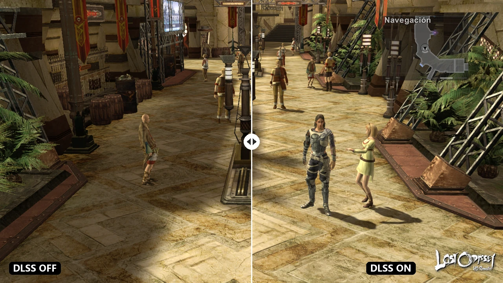
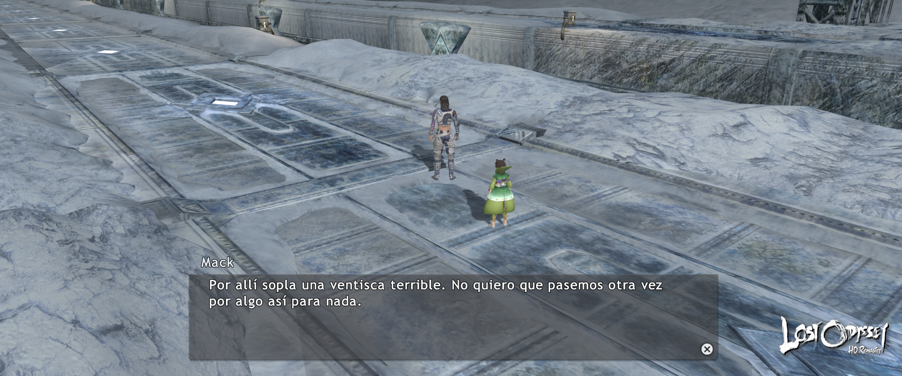
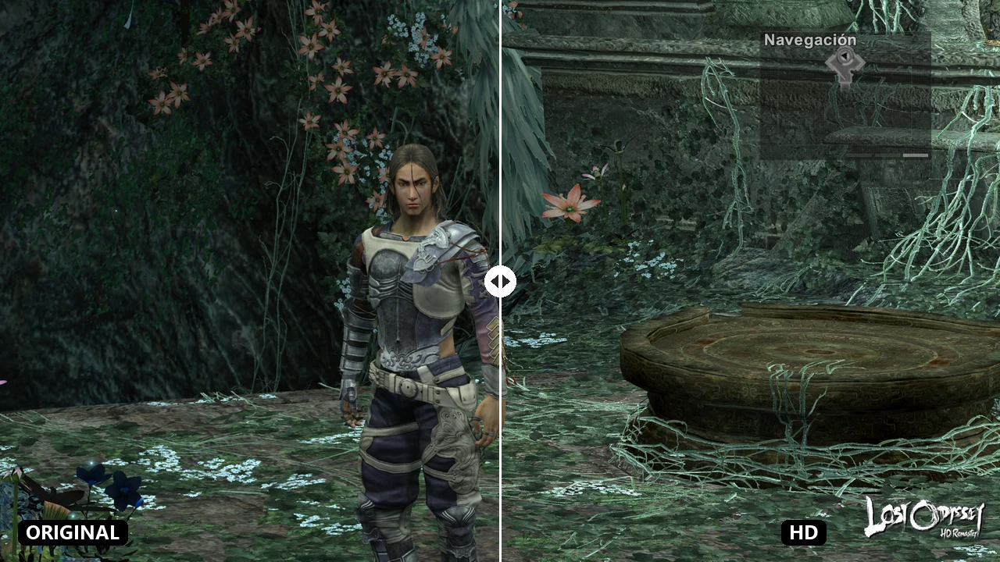
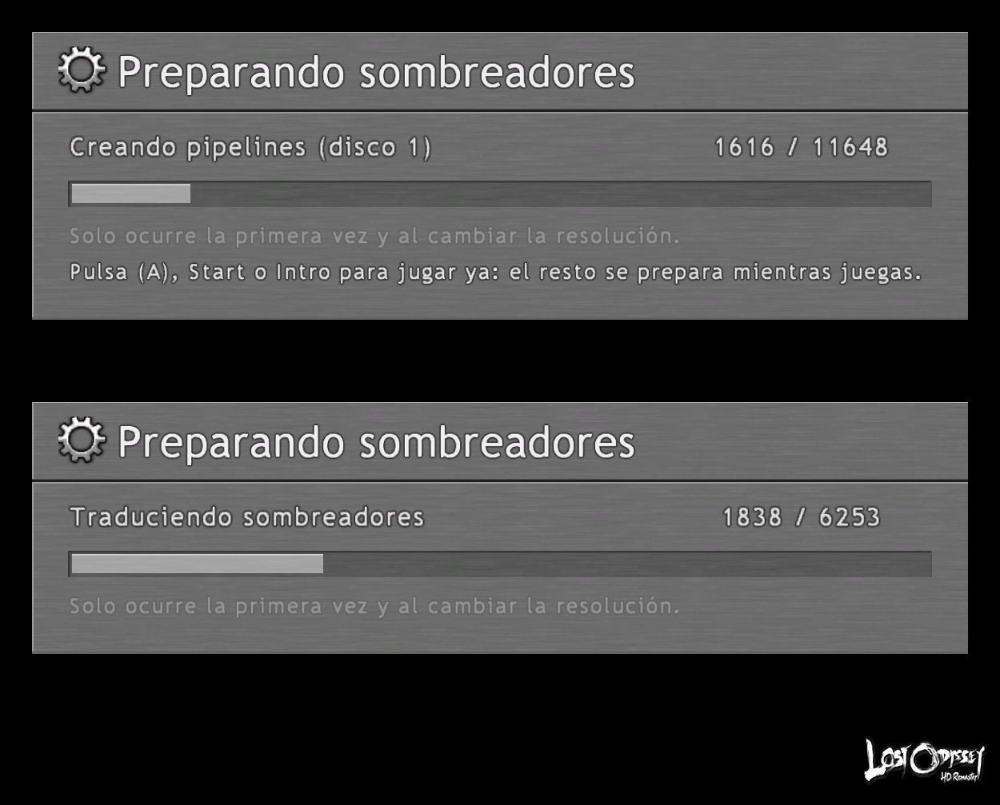

# Lost Odyssey HD Remaster

**Lost Odyssey, nativo en PC. Hasta 4K, a 60 fps y sin los cierres por los que se le conoce.**

*[Read this in English](README.md)*

> **Estado:** versión de prueba v0.0.1 — jugable, con muchos fallos conocidos · código abierto (MIT) · trae tus propios discos
> Las descargas aparecerán en [Releases](../../releases) cuando se publique la primera versión. Mira las [preguntas frecuentes](docs/faq.md).

Lost Odyssey salió en Xbox 360 en 2007 y nunca salió de ahí. Este proyecto reconstruye el código original del juego como un programa de Windows de verdad —**no es un emulador**— y le da después lo que le daría una remasterización.

---

## Qué trae

- **De 720p a 4K, y panorámico.** Eliges la resolución de salida —también Steam Deck (1280×800) y dos modos 21:9— y, por separado, con cuánta nitidez se dibuja el 3D.
- **Una interfaz siempre nítida.** Menús, HUD y diálogos se dibujan a la resolución de tu pantalla cueste lo que cueste el 3D, y quedan justo donde los puso la consola.
- **DLSS.** DLAA, Calidad, Equilibrado, Rendimiento y Ultra rendimiento para el 3D, en Direct3D 12 y en Vulkan.
- **60 fps.**
- **Los cierres conocidos ya no están.** La celda de la prisión, la cinemática tras el primer jefe, el tren congelado. No ocurre ninguno, y sin trucos para esquivarlos.
- **Sin tirones de shaders.** El port lee tus discos y prepara todos los pipelines que el juego va a necesitar antes de jugar.
- **Texto nítido.** Las fuentes del juego redibujadas desde cero a cuatro veces la resolución.
- **Packs de texturas HD.** Se cargan en segundo plano, sin tirones; cambia cualquier textura y recárgala sin salir del juego.
- **Sin batallas aleatorias**, con un interruptor. Los jefes y los combates de la historia siguen.
- **Guardar en cualquier sitio.**
- **Turbo hasta ×8**, en un botón.
- **Cuatro discos, sin cambiarlos.** El juego cambia de disco solo.
- **Seis idiomas** para los textos del juego, a elegir desde el menú.
- **Botones de PlayStation en pantalla**, si ese es el mando que tienes en las manos.
- **Todo desde el menú del propio juego**, como si hubiera venido así.

[Todas las características, explicadas →](docs/features.es.md)

---

## Míralo

### 720p frente a 1080p

| Resolución original de la consola | Este port a 1080p |
|---|---|
|  |  |

### DLSS

La misma escena, con el 3D ampliado sin DLSS y con DLSS Calidad.

A tamaño completo: [sin DLSS](media/dlss-off.png) · [con DLSS](media/dlss-on.png)

### Panorámico

### Texturas HD

A tamaño completo: [original](media/hd-textures-before.png) · [pack HD](media/hd-textures-after.png)

### Una interfaz que no se mueve

Al subir la resolución de un juego de consola los menús suelen descolocarse: un cuadro fuera de su panel, una línea que no apunta a nada. Aquí no. Y la interfaz se dibuja a la resolución completa de tu pantalla aunque el 3D vaya a menos.

### Texto que se lee

La misma línea de diálogo, ampliada. Arriba el original, abajo este port.

### Opciones que parecen del propio juego

Pulsa **RB** en la pantalla de Configuración del juego y aparecen cuatro pestañas nuevas, dibujadas con la fuente, los paneles y el cursor del propio juego.

### Botones de PlayStation

### Listo antes de jugar

En el primer arranque el port lee tus discos y prepara los shaders del juego, en una pantalla hecha con las fuentes y las texturas del propio juego.

> **Recomendado: deja que compile todos los shaders** (elige *todos los discos* en el instalador o en Config → Extras). La primera vez tarda unos minutos por disco, pero después el juego va sin tirones ni aparición de texturas en todos los discos. Elegir solo la parte actual funciona, pero habrá tirones al llegar por primera vez a cada zona nueva.

### Pantalla de título

---

## Versión del juego compatible y equipo de pruebas

Funciona con la edición **"USA, Europe" de Lost Odyssey (Xbox 360), los cuatro discos** — la multilenguaje: inglés, japonés, francés, alemán, español e italiano. El instalador comprueba tus discos con hashes conocidos; la edición asiática aún no está admitida.

Todo se ajustó en **un solo PC** (Windows 11, Core i9-10850K, 32 GB de RAM, GeForce RTX 3080 de 10 GB). No se ha probado con nada más, así que otro equipo puede comportarse distinto. Detalles: [Compatibilidad y equipo de pruebas](docs/compatibility.md).

---

## Cómo va

| | |
|---|---|
| **Jugable** | Sí — sesiones largas, partidas guardadas, logros, cinemáticas |
| **Cierres conocidos** | Arreglados |
| **Renderizadores** | Direct3D 12 y Vulkan |
| **DLSS** | En los dos renderizadores |
| **Discos** | Los cuatro, desde carpetas, imágenes ISO o Games on Demand |
| **Linux** | Previsto, aún sin compilar |

La parte honesta: todos los cierres que conocemos están arreglados, pero nadie ha jugado todavía esta versión desde el primer minuto hasta los créditos. La capa de interfaz nítida es lo más reciente en Vulkan, y algunas escalas 3D (×1,25, ×1,75 y otros cuartos) solo se han probado por encima. En pantallas panorámicas los vídeos aún salen estirados.

La primera versión de prueba (v0.0.1) es para quien quiera probarla y avisar de los cierres: el propio juego los comunica (abre un informe de GitHub ya rellenado). Siempre hace falta tu propia copia del juego.

---

## ¿Quieres los detalles?

- **[Características en detalle](docs/features.es.md)** — qué hace cada una, y la lista completa de fallos arreglados.
- **[Notas técnicas](docs/technical.md)** — cómo se hizo, para quien quiera hacer lo mismo con otro juego. En inglés.
- **[Registro de avances](docs/progress.md)** — qué cambió y cuándo. En inglés.
- **[Preguntas frecuentes](docs/faq.md)** — qué hace falta para jugar y más. En inglés.
- **[Notas de la v0.0.1](docs/releases/v0.0.1.md)** y [cómo se publican versiones y actualizaciones](docs/releasing.md).
- **[Compilar desde el código](docs/building.md)** (en inglés) y las [notas de desarrollo](docs/dev/README.md) (en español).

---

## Créditos

Desarrollado y mantenido por **[FaliGame](https://github.com/FaliGame)**.

Apoyado en el trabajo de otros:

- **[ReXGlue](https://github.com/rexglue/rexglue-sdk)** — el SDK de recompilación estática sobre el que está construido el port, y el plugin de GPU Xenos del que sale este fork.
- **[Xenia](https://xenia.jp/)** — el emulador cuya investigación sobre la GPU sostiene prácticamente todo el trabajo gráfico de Xbox 360, este proyecto incluido. Los shaders de compute del plugin se compilan a partir de las fuentes de shaders de Xenia, bajo su licencia BSD.
- **boma** — el conjunto original de parches de Xenia Canary para Lost Odyssey, reimplementados aquí como interruptores en tiempo de ejecución.
- **re:Blue** — la recompilación de Blue Dragon, que enseñó cómo debe quedar un port terminado sobre este SDK.
- **[SMAA](https://github.com/iryoku/smaa)** — de Jorge Jimenez, Jose I. Echevarria, Belen Masia, Fernando Navarro y Diego Gutierrez; usado sin modificar bajo su licencia MIT.
- **[lzokay](https://github.com/jackoalan/lzokay)** — descompresión LZO (MIT), para leer las texturas del juego.
- **[stb](https://github.com/nothings/stb)** — escritura de PNG (dominio público), para el volcado de texturas.
- **[NVIDIA DLSS](https://github.com/NVIDIA/DLSS)** — mediante el NVIDIA RTX SDK, bajo su licencia. NVIDIA y DLSS son marcas de NVIDIA Corporation.

---

## Aviso legal

Este repositorio contiene el **código fuente del port** (MIT, ver [LICENSE](LICENSE) y [THIRD_PARTY.md](THIRD_PARTY.md)). **No contiene código del juego, ni recursos del juego, ni código recompilado, ni ejecutables**: el código recompilado se genera en tu equipo a partir de tu propio disco, y el pack de texturas HD va cifrado y solo se abre con los discos con los que se hizo.

Lost Odyssey es © Microsoft / Mistwalker / Feelplus. Este es un proyecto de preservación y porteo sin afiliación y sin ánimo de lucro. Aquí no se distribuye el juego: hace falta tu propia copia obtenida legalmente.
