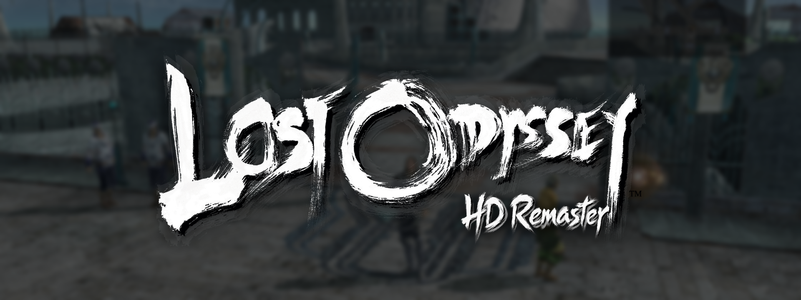
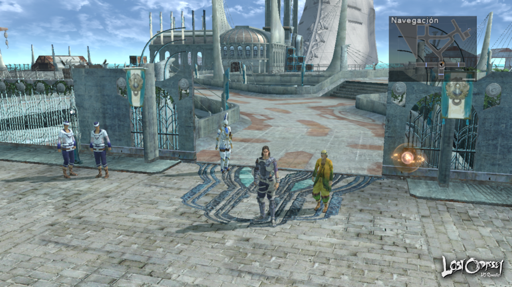
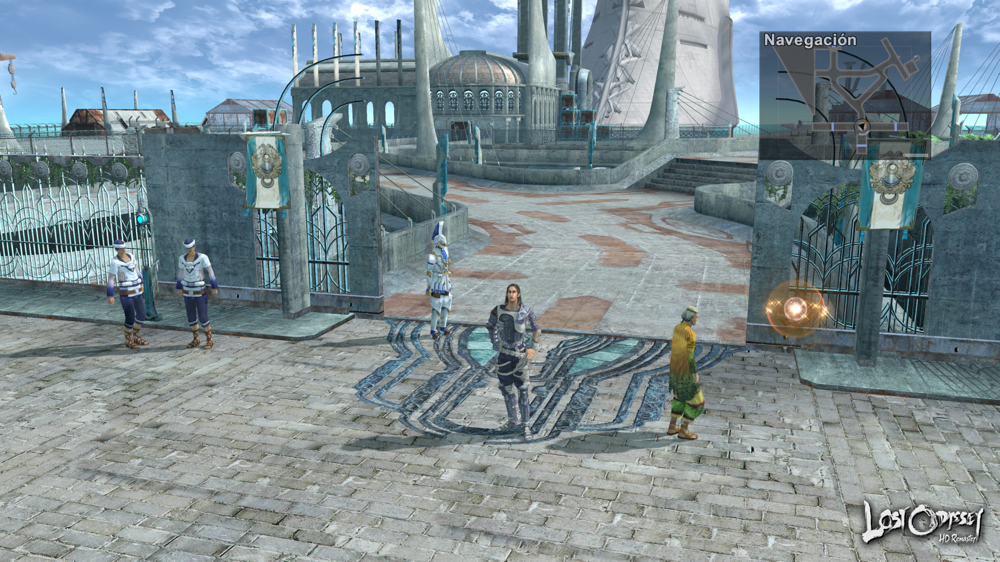
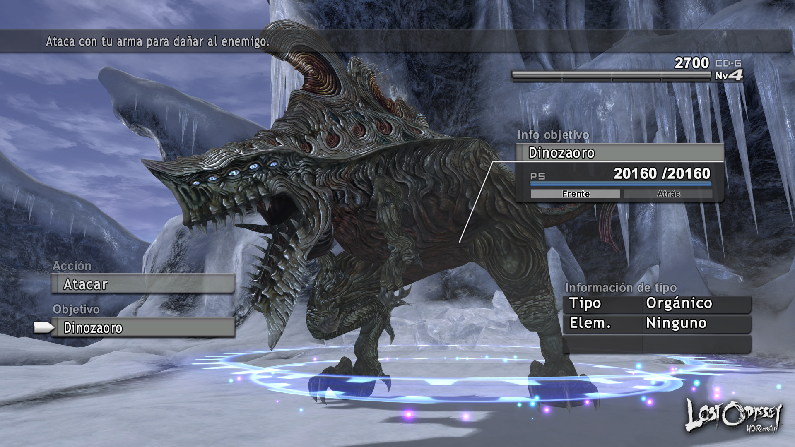
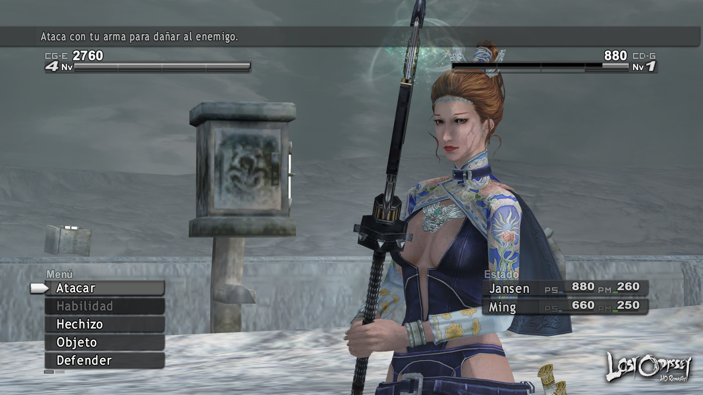
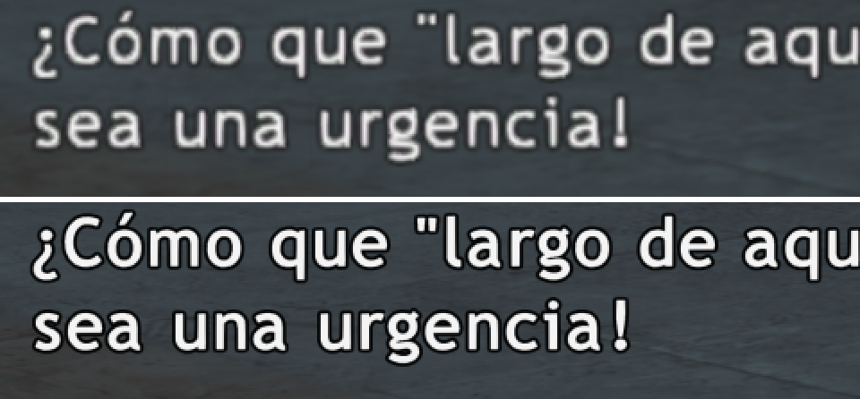
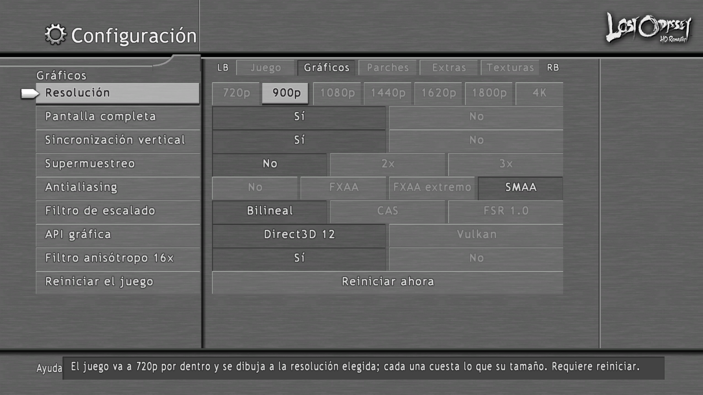
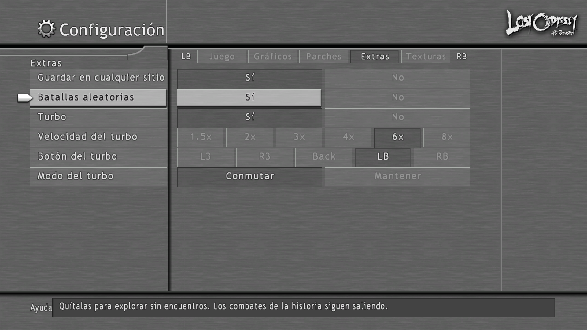
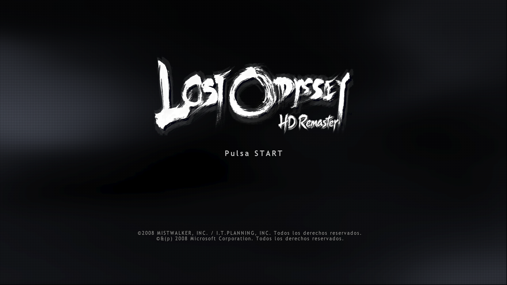

# Lost Odyssey HD Remaster

**Lost Odyssey, running natively on PC. Up to 4K, 60 fps, and without the crashes it is known for.**

*[Léeme en español](README.es.md)*

> **Status:** in development · playable · source not public yet · no downloads
> This repository is a progress window, not a release. See the [FAQ](docs/faq.md).

Lost Odyssey came out on Xbox 360 in 2007 and never left it. This project rebuilds the original game code as a real Windows program — **not an emulator** — and then gives it what a remaster would.

---

## What you get

- **720p to 4K, and ultrawide.** Pick the output resolution — including Steam Deck (1280×800) and two 21:9 modes — and, separately, how sharp the 3D is rendered.
- **An interface that is always sharp.** Menus, HUD and dialogue are drawn at your screen's resolution whatever the 3D costs, and stay exactly where the console put them.
- **DLSS.** DLAA, Quality, Balanced, Performance and Ultra Performance for the 3D, on Direct3D 12 and Vulkan.
- **60 fps.**
- **The known crashes are gone.** The prison cell, the cutscene after the first boss, the frozen train. None of them happen, with no workarounds.
- **No shader stutter.** The port reads your discs and prepares every pipeline the game will need before you play.
- **Sharp text.** The game's fonts redrawn from scratch at four times the resolution.
- **HD texture packs.** Loaded in the background with no hitches; swap any texture and reload it without leaving the game.
- **No random encounters**, at the flick of a switch. Boss and story fights stay.
- **Save anywhere.**
- **Turbo up to 8×**, on a button.
- **Four discs, no swapping.** The game changes disc by itself.
- **Six languages** for the game's text, switchable from the menu.
- **PlayStation button prompts**, if that is the controller in your hands.
- **All of it in the game's own menu**, looking as if it shipped that way.

[Every feature, explained →](docs/features.md)

---

## See it

### 720p vs 1080p

| Original console resolution | This port at 1080p |
|---|---|
|  |  |

### DLSS

The same scene with the 3D rendered at 720p and upscaled, without and with DLSS.

<!-- PLACEHOLDER: media/dlss-off.png y media/dlss-on.png -->
| DLSS off | DLSS Quality |
|---|---|
| *(screenshot coming soon)* | *(screenshot coming soon)* |

### Ultrawide

<!-- PLACEHOLDER: media/ultrawide.png -->
*(screenshot coming soon)*

### HD textures

<!-- PLACEHOLDER: media/hd-textures-before.png y media/hd-textures-after.png -->
| Original | HD pack |
|---|---|
| *(screenshot coming soon)* | *(screenshot coming soon)* |

### An interface that stays put

Raise the resolution of a console game and the menus usually drift: a box off its panel, a line pointing at nothing. Not here. And the interface is drawn at the full resolution of your screen even when the 3D is rendered lower.

### Text you can read

The same line of dialogue, enlarged. Original above, this port below.

### Options that look like the game's own

Press **RB** on the game's Configuration screen and four new tabs appear, drawn with the game's own font, panels and cursor.

<!-- PLACEHOLDER: sustituir media/in-game-settings.png por la pestaña Gráficos nueva (Resolución, Escala 3D, DLSS, Nitidez 3D) -->

### PlayStation prompts

### Ready before you play

On the first launch the port reads your discs and prepares the game's shaders, on a screen made from the game's own fonts and textures.

<!-- PLACEHOLDER: media/shader-prep.png -->
*(screenshot coming soon)*

### Title screen

<!-- PLACEHOLDER: sustituir media/title-screen.png por el título con el logo "HD Remaster" -->

---

## Where it stands

| | |
|---|---|
| **Playable** | Yes — long sessions, saves, achievements, cutscenes |
| **Known crashes** | Fixed |
| **Renderers** | Direct3D 12 and Vulkan |
| **DLSS** | Both renderers |
| **Discs** | All four, from folders, ISO images or Games on Demand |
| **Linux** | Planned, not built yet |

The honest part: every crash we know of is fixed, but nobody has played this build from the first minute to the credits yet. The sharp-interface layer is newest on Vulkan, and some 3D scales (×1.25, ×1.75 and other quarter steps) have only been lightly tested. On ultrawide screens videos are still stretched.

There is no download. When there is one, it will need your own copy of the game.

---

## Want the details?

- **[Features in detail](docs/features.md)** — what each feature does, and the full list of fixed bugs.
- **[Technical notes](docs/technical.md)** — how it was done, for people doing the same to another game.
- **[Progress log](docs/progress.md)** — what changed and when.
- **[FAQ](docs/faq.md)** — where the source is, what you will need to play, and more.

---

## Credits

Built and maintained by **[FaliGame](https://github.com/FaliGame)**.

Standing on other people's work:

- **[ReXGlue](https://github.com/rexglue/rexglue-sdk)** — the static recompilation SDK this port is built on, and the Xenos GPU plugin this project forks.
- **[Xenia](https://xenia.jp/)** — the emulator whose GPU research underpins essentially all Xbox 360 graphics work, this project included. The plugin's compute shaders are built from Xenia's shader sources, under their BSD licence.
- **boma** — the original Xenia Canary patch set for Lost Odyssey, reimplemented here as runtime switches.
- **re:Blue** — the Blue Dragon recompilation, which showed how a finished port on this SDK should look.
- **[SMAA](https://github.com/iryoku/smaa)** — by Jorge Jimenez, Jose I. Echevarria, Belen Masia, Fernando Navarro and Diego Gutierrez; used unmodified under its MIT licence.
- **[lzokay](https://github.com/jackoalan/lzokay)** — LZO decompression (MIT), used to read the game's textures.
- **[stb](https://github.com/nothings/stb)** — PNG writing (public domain), used by the texture dump.
- **[NVIDIA DLSS](https://github.com/NVIDIA/DLSS)** — through the NVIDIA RTX SDK, under its licence. NVIDIA and DLSS are trademarks of NVIDIA Corporation.

---

## Legal

This repository contains **no game code, no game assets, and no executables** — only documentation and screenshots.

Lost Odyssey is © Microsoft / Mistwalker / Feelplus. This is an unaffiliated, non-commercial preservation and porting effort. Nothing here will ever distribute the game: any future release would require you to supply your own legally obtained copy.

Documentation in this repository is © its author. All rights reserved.
